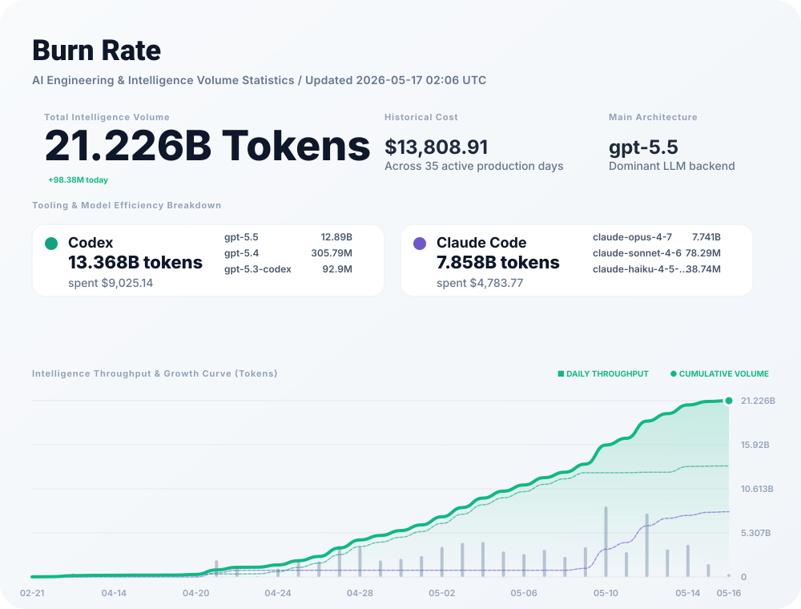

# BurnRate (燃耗统计)

[English](#usage) | [中文说明](#中文说明) | [使用指南 (GUIDE)](./GUIDE.md)

Generate a GitHub profile SVG card from the ccusage family of local JSON exports.
从 ccusage 系列本地 JSON 导出数据生成 GitHub 个人主页 SVG 统计卡片。

---

### 🚀 One-Step Sync (Recommended)

Run everything (export, generate, and push) with a single command:

```bash
bun run sync
```

### 🛠️ Using Your Own Fork (For New Users)

If you just forked this repository to track your own usage:

1. Clone your fork locally.
2. Clean the template data:
   ```bash
   bun run clean
   ```
3. Run the sync command to generate and push your data!
   ```bash
   bun run sync
   ```
4. Update your GitHub Profile README: Replace `<owner>` with your GitHub username:
   ```markdown
   
   ```
   *(Note: Ensure your GitHub Actions have "Read and write permissions" enabled in Settings -> Actions -> General)*

### Manual Steps

The exporter calls these commands and writes one JSON file per tool into `data/`:

```bash
bunx ccusage@latest claude daily --json
bunx ccusage@latest codex daily --json
bunx ccusage@latest opencode daily --json
bunx ccusage@latest pi daily --json
bunx ccusage@latest amp daily --json
```

Generate the card locally:

```bash
bun run generate:card
```

---

## 中文说明

### 🚀 一键同步（推荐）

使用一个命令完成所有操作（导出、生成并推送）：

```bash
bun run sync
```

### 🛠️ Fork 后如何使用 (给新用户)

如果你刚刚 Fork 了这个仓库来追踪你自己的使用量：

1. 克隆你的 Fork 仓库到本地。
2. 清理模板数据：
   ```bash
   bun run clean
   ```
3. 运行同步命令来生成并推送你的专属数据！
   ```bash
   bun run sync
   ```
4. 更新你的 GitHub 个人主页 README：将 `<你的用户名>` 替换为你的 GitHub 用户名：
   ```markdown
   
   ```
   *(注意：请确保你的 GitHub Actions 在 Settings -> Actions -> General 中开启了 "Read and write permissions" 权限)*

### 分步手动操作

2. **生成卡片**:
   ```bash
   bun run generate:card
   ```
   这会根据导出的数据生成 `assets/ccusage-card.svg` 文件。

### 🔍 Analyzing Usage / 消耗分析

View a detailed report of your highest usage days and sessions:
查看你的消耗大户报告（单日或单次对话）：

```bash
bun run analyze
```

3. **详细配置**:
   请参考 [使用指南 (GUIDE.md)](./GUIDE.md) 查看环境变量和进阶用法。

```markdown

```

### ✨ Modern Analytics Features / 现代分析特性

- **Dynamic Precision**: Automatic precision scaling for Billion-scale data (e.g., `1.503B`).
- **Local Today Delta**: Real-time daily growth display based on your local timezone.
- **动态精度**: 针对 B 级数据自动调整小数点（如 `1.503B`），确保百万级更新可见。
- **本地增量**: 基于用户本地时区的每日增长实时展示（`+XX today`）。

## Options / 选项

Set environment variables before running the exporter:
在运行导出脚本前设置环境变量：

```bash
CCUSAGE_SINCE=20260401 CCUSAGE_TIMEZONE=UTC bun run sync
```

- `CCUSAGE_SINCE`: optional start date (e.g. `20260401`) / 可选开始日期
- `CCUSAGE_UNTIL`: optional end date (e.g. `20260426`) / 可选结束日期
- `CCUSAGE_TIMEZONE`: optional timezone / 可选时区
- `CCUSAGE_COMMIT=0`: export without committing / 导出但不提交
- `CCUSAGE_PUSH=0`: commit without pushing / 提交但不推送
